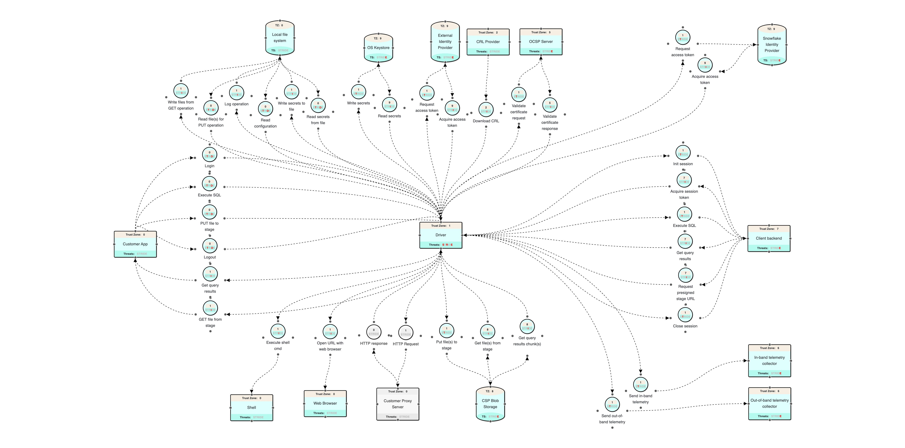

# Driver Trust-Boundary Risks

The driver sits between the host application (foreign code embedding it) and
several external systems. Each edge is a trust boundary where untrusted input
crosses into the driver or driver-held secrets / customer data could cross out.

## Boundaries

The authoritative enumeration, derived from the driver threat model
([data-flow diagram](threats.jpeg)) and
[`doc/architecture.md`](../doc/architecture.md). The
[Invariant Threat Model](#invariant-threat-model) works through each one (B1–B16).

- **B1 — OS file system** (config, results, cache, log files)
- **B2 — OS keystore** (macOS Keychain / Windows Credential Manager / Linux Secret
  Service; the on-disk token cache is only the fallback when no persistent keystore
  exists)
- **B3 — Snowflake backend REST API** (TLS)
- **B4 — Cloud provider blob storage** (S3 / GCS / Azure stage)
- **B5 — Proxy** (all driver egress may transit a customer/enterprise proxy that
  can see — and, if TLS-terminating, MITM — every request; it also `gzip`s
  responses)
- **B6 — Third-party revocation egress** (CRL distribution-point hosts,
  CA-controlled)
- **B7 — Identity providers** (two distinct: the External IdP — Okta / SAML / OAuth
  — and the Snowflake IdP)
- **B8 — Web browser + system shell** (interactive auth opens an IdP URL in the
  user's browser; the OS launch path can route through a shell)
- **B9 — Logging** (the log sink: stderr / log file / the host's log pipeline)
- **B10 — Telemetry** (in-band, session-gated; and out-of-band, modeled)
- **B11 — Configuration** (`connections.toml` / `config.toml` and connection
  parameters)
- **B12 — Process environment** (env vars, home dir — the host application's trust
  domain)
- **B13 — FFI / Protobuf wrapper boundary** (the Rust core's C-ABI + protobuf
  surface consumed by 7 wrappers: JDBC, ODBC, Python, .NET, Node.js, Go, PHP)
- **B14 — Host application** (the foreign code embedding the driver and calling its
  public API)
- **B15 — Third-party dependencies** (the transitive graph pulled into the customer
  process — supply chain)
- **B16 — Cloud instance-metadata / Workload Identity Federation (WIF)** (the
  link-local instance-metadata service — AWS/Azure IMDS `169.254.169.254`, GCP
  `metadata.google.internal` — plus the cloud STS/IAM endpoints the WIF attestation
  module contacts to mint the identity token forwarded to Snowflake)

## Risky areas (coarse grouping)

1. Local file system — uploading/downloading files, writing result downloads,
   reading credential/config files
2. Cloud provider bucket operations (S3 / GCS / Azure)
3. Driver backend REST API (TLS / networking)
4. Third-party egress & proxy — proxy transit, CRL revocation fetches
5. Authentication (browser/shell, IdPs, keystore)
6. Telemetry (sending unwanted details)
7. Logging

## Approach

We apply an **invariant** threat model to each boundary: state the "what must never
happen" at the edge, uphold it in code, and either avoid the problem or document
who owns it (driver team vs. customer embedding the driver). The
[Guidelines by risk area](#guidelines-by-risk-area) give the actionable
invariant/doc split; the [Invariant Threat Model](#invariant-threat-model) gives
the formal per-boundary model.

# Guidelines by risk area

For each area: **Driver responsibility** = the "must never happen" the driver
upholds in its own code (driver-team owned); **Doc — customer responsibility** =
what the embedding developer must do or know (customer owned, plus the disclosure
the driver owes them so they can).

A point tagged **[posture]** is not currently guaranteed by an implemented guard —
it is forward-looking (feature not yet built), a design-judgment call, or upheld by
a general convention rather than a boundary-specific invariant.

## 1. Local file system

**Driver responsibility**

- A GET/download derives its on-disk destination from a server-supplied name,
  which is untrusted. Reduce it to a safe basename (reject `""`, `.`, `..`,
  separators, drive letters, NUL) and join onto a **canonicalized** destination
  dir with a `starts_with(base_dir)` containment re-check before any write —
  the two-layer guard already in `file_manager` (SNOW-3704966). Never pass the
  raw value into `Path::join`.
- Read the *contents* of credential/config files through the `FsAdapter` seam so
  permission/size/ownership policy stays centralized.
- **IO races (TOCTOU):** make ownership/permission/type trust decisions on the
  **open fd** (`file.metadata()`), never `stat`-on-path then a separate open.
  Use the `fs_lock.rs` hardened openers — `O_NOFOLLOW` on existing sensitive
  files, `O_EXCL`/`create_new` for atomic creation with the mode set at creation,
  and an `O_EXCL` random-temp probe (`filesystem_now`) for shared dirs. Reference:
  `token_cache/file_cache.rs::validate_file_fd`.
- **Injected config:** config/connection files must pass the permission gate
  (`config/toml_loader.rs::check_file_permissions` rejects group/other-writable),
  bypassable only via the explicit `unsafe_skip_file_permissions_check` param
  (logged). Resolve config locations from the fixed platform/`SNOWFLAKE_HOME`
  resolver, not an unvalidated caller string.

**Doc — customer responsibility:**

- PUT reads exactly the local paths/globs they pass; a GET only writes inside the
  destination directory they supply. Choosing a safe, non-shared destination
  directory (and its permissions) is the embedder's responsibility.
- The driver refuses to read a `connections.toml` / `config.toml` that is
  writable by group/others; keeping those files `0600`-ish (and the
  `~/.snowflake` dir private) is the embedder's responsibility, and
  `unsafe_skip_file_permissions_check` opts out at their own risk.

## 2. Cloud provider bucket operations

**Driver responsibility**

- Verify integrity of fetched bytes before surfacing them: SHA-256 digest on
  client-side-encrypted content, content-length match where known, and
  temp-file + atomic `rename` so partial plaintext is never observable.
- The transfer endpoint / bucket / presigned URL must come from the
  Snowflake-issued stage credentials for this operation — never a caller-mutable
  or cross-parsed host string.
- **Presigned URLs and stage credentials are bearer secrets.** A presigned/SAS URL
  carries its capability in the query string, so possession alone grants
  time-bounded bucket access. Keep cloud creds and the stage master key
  (`query_stage_master_key`) in `SensitiveString`; never log, telemeter, or
  error-message a presigned URL, a stage credential, or the master key; strip
  query/fragment from any storage URL that is logged. (`smk_id` is a key
  reference, not a secret.)

**Doc — customer responsibility:**

- The driver only reaches the cloud endpoint Snowflake hands it for the stage;
  network egress policy to those endpoints is the embedder's environment concern.

## 3. Driver backend REST API (TLS / networking)

**Driver responsibility**

- Certificate chain, hostname, and CRL/revocation checks stay on for every
  outbound connection. Insecure-TLS constructors (`TlsConfig::insecure()`,
  `danger_accept_invalid_certs`, no-op verifiers) are test-only and must be
  `#[cfg(any(test, feature = "test-utils"))]`-gated — no runtime config flag may
  turn verification off in a shipped build.

**Doc — customer responsibility:**

- The driver validates TLS to the Snowflake host; supplying a correct account
  host and any proxy/CA trust store for their environment is the embedder's
  responsibility.

## 4. Third-party egress & proxy

Everything the driver contacts that is **not** the Snowflake backend or the
account's own cloud stage: the proxy it transits, and the CA/third-party hosts it
reaches for revocation checking. These are outside Snowflake's control, so each is
both a data/metadata-leak channel and an availability dependency.

**Driver responsibility**

- **Proxy** (`tls/config.rs::ProxyConfig`): every outbound HTTP client the driver
  builds — main REST, cloud storage, CRL fetches, diagnostics — must be
  constructed from the driver's `ProxyConfig` so traffic routes consistently.
  Env-var proxies (`HTTP_PROXY`/`HTTPS_PROXY`/`NO_PROXY`) stay **off** unless the
  caller opts in via `use_proxy_env` (default `false`); explicit config overrides
  env. Proxy credentials are `SensitiveString` and never logged. A networked path
  that builds a bare `reqwest::Client` ignoring `ProxyConfig` is a violation
  (traffic silently bypasses the configured proxy).
- **CRL fetches to third-party hosts**: the target URL is derived from the
  presented certificate (CRL distribution points) — untrusted input. Such a fetch
  must cap the response size (`crl_max_download_size`, 20 MB default), enforce
  connect/read timeouts, restrict the scheme to http/https, and **verify the
  payload signature against the issuer** (`verify_crl_signature`) before trusting
  it. Cache the result owner-only on disk (same TOCTOU-hardened path + the
  `crl_unsafe_skip_file_permissions_check` gate). Revocation checking is
  **off by default** (`CertRevocationCheckMode::Disabled`); `Advisory` fails open
  on non-revocation errors (host down, parse error), `Enabled` fails closed.
- **OCSP is intentionally not supported.** CRL is the driver's only revocation
  mechanism — there is no stapled-OCSP verification and no OCSP responder fetching,
  by design.

**Doc — customer responsibility:**

- Enumerate the **complete** set of hosts the driver may contact: the Snowflake
  account host, the account's cloud-stage endpoints, the proxy (if configured),
  and — only when revocation checking is enabled — the CRL distribution-point
  hosts named in the server's certificate chain (CA-operated). Regulated /
  air-gapped / gov-cloud deployments need this list for egress allow-listing.
- Revocation fetches reveal to the CA which endpoints the client is connecting to
  and when; customers who cannot tolerate that leave `crl_check_mode` disabled (the
  default) or route it through their proxy.
- A TLS-terminating corporate proxy can inspect all driver traffic; whether that is
  acceptable is the customer's policy decision, and supplying the proxy's CA trust
  is their responsibility.

## 5. Authentication (browser/shell, IdPs, keystore)

**Driver responsibility**

- **Callback validation:** browser/OAuth flows validate the returned
  `state`/`nonce` against the generated value and accept the callback only on the
  redirect URI/port the driver registered, before exchanging/accepting a token.
- **Browser launch / shell (command-execution boundary):** the IdP-supplied URL
  is opened via the validating launcher (`rest/snowflake/browser.rs::open_url`),
  which requires `https`, rejects shell/argv metacharacters and control bytes, and
  never routes through a shell interpreter (WSL uses `explorer.exe`, not `cmd`).
  Never call `webbrowser::open` / `std::process::Command` directly on a
  server-supplied URL.
- **Two IdPs** — **[posture]** (no dedicated invariant yet): the authorize URL and
  token endpoint must be the configured / expected External-IdP or Snowflake-IdP
  host — not an arbitrary host taken from a response (open-redirect to an attacker
  IdP).
- **Secret storage — OS keystore + file fallback:** secrets live in the OS
  keystore (`token_cache/keyring_cache.rs`, service `snowflake_credential_cache`)
  when available, else the owner-only (`0600`) file cache. Both hold
  `SensitiveString`; the file path is TOCTOU-hardened. The `SensitiveString`
  wrapping itself is a general secret-handling convention; the keystore-vs-file
  choice and keystore access scope are **[posture]**.

**Doc — customer responsibility:**

- Secrets they pass (password, PAT, private key, passphrase) are held in
  zeroizing wrappers and never logged; protecting the source of those secrets
  (env, key file, secret manager) and the token-cache directory is the embedder's
  responsibility.
- Where cached credentials live per platform (OS keystore vs. `~/.cache/snowflake`
  fallback), and that on shared-session platforms (e.g. Linux Secret Service) the
  keystore's access scope is the OS/embedder's policy, not the driver's.

## 6. Telemetry

**Driver responsibility**

- In-band telemetry is sent only when the server opts the session in
  (`CLIENT_TELEMETRY_ENABLED`) with a configured session registry — never
  unconditionally.
- Payloads carry approved operational metadata only (session/request id,
  operation name, error **type**, timings, counts, environment info). Never query
  text, bindings, result data, secrets, file paths, or foreign error messages.
- **Out-of-band telemetry** — **[posture]** (modeled in the threat model; not
  implemented in core today): if added, it fires around connection/login
  **before a session exists**, so it cannot use the in-band
  `CLIENT_TELEMETRY_ENABLED` session gate. It must therefore have its **own**
  disable switch (default conservative), send only non-identifying diagnostic
  metadata (never account/user/host-identifying detail, secrets, or foreign error
  messages), and go only to the Snowflake telemetry endpoint.

**Doc — customer responsibility:**

- What telemetry the driver sends (in-band and, if present, out-of-band), that
  in-band follows the server-side switch, and how to disable each.

## 7. Logging

Owned by [`doc/logging/logging-guidelines.md`](../doc/logging/logging-guidelines.md):
never log secrets or result data, log HTTP host+path only (no query/fragment),
gate query text/params behind opt-in flags, log foreign error type only, and log
stack traces only for unhandled errors (no captured locals).

# Client-side library outside Snowflake's control

Once released and embedded, a copy of the driver runs inside the customer's
application, on their machines, with **their** privileges and **their** update
cadence — Snowflake has no runtime control over it. That reframes several risks
that a server-side component would not have. These are mostly **[posture]**
concerns rather than single reviewable invariants; call them out so design
decisions account for them.

1. **No forced upgrades — old versions live in the wild indefinitely.**
   Customers pin old versions. Implications we already act on: don't disclose how
   a fixed issue worked, keep **backward-safe defaults** (revocation off, env-proxy
   off, telemetry server-gated), and report the driver version to the backend so
   Snowflake can see the deployed fleet and signal deprecation. Never rely on
   "everyone is on the latest version".

2. **Runs with the host application's privileges (ambient authority).**
   The driver inherits the app's full filesystem/network/env/memory access, so it
   must behave least-privilege: read only the files it needs, write only under its
   own cache/stage dirs, open only the listeners it needs (OAuth loopback), and
   constrain the one place it spawns something outside itself — the external
   **browser launch** (inject the launcher, don't shell out to an arbitrary
   command).

3. **The process environment is set by whoever runs the process — trusted as the
   caller, but distinct from the filesystem.**
   Env vars and config (`SNOWFLAKE_HOME`, `SF_TEMPORARY_CREDENTIAL_CACHE_DIR`, proxy
   vars, cache dirs, log level) live in the host application's trust domain, not
   Snowflake's. Crucially this is a *higher* trust level than the filesystem: only
   the principal that launched the process controls its environment, whereas a
   file or directory may be shared with — and writable by — lower-trust local
   co-tenants. So env input is trusted as far as the caller is, but any *path* it
   yields still crosses into the filesystem, where the B1 invariants
   (permission/ownership gates, no symlink/TOCTOU) must still hold. Fail safe: gate
   config-file permissions, keep env-proxy opt-in, and treat every env-driven path
   as data feeding the filesystem invariants above.

4. **Supply chain — every transitive dependency runs in the customer's process.**
   Crates/JARs/npm packages the driver pulls in execute with the same ambient
   authority. Posture: pin via lockfiles, avoid post-install scripts, minimize and
   vet dependencies, publish signed releases + an SBOM, and prefer reproducible
   builds. A dependency bump is a security-relevant change.

5. **Data residency & the full egress map.**
   Every host the driver contacts determines where bytes and connection metadata
   go: Snowflake host, the account's cloud stage (region-bound), the proxy, — if
   revocation is enabled — CA CRL distribution-point hosts, and — if WIF auth is
   used — the cloud instance-metadata service and cloud STS/IAM endpoints. Document
   the complete list and keep every egress explainable and disableable; no silent
   phone-home, no auto-update.

6. **Secrets live as long as the host process.**
   A long-lived embedding keeps tokens/keys in memory for the app's lifetime.
   Mitigations already in place: zeroize-on-drop (`SensitiveString`), owner-only
   on-disk caches, and never emitting secrets to logs/telemetry/errors (which flow
   into the *customer's* pipelines, not Snowflake's). Be mindful that a host
   crash/core dump can capture process memory.

7. **Untrusted / hostile server & third-party responses (resource abuse).**
   The driver must not assume the peer is benign: cap response and CRL sizes,
   bound decompression (gzip/zstd — guard against decompression bombs), set
   timeouts, and bound memory for result chunks. Fail closed on oversize.

8. **Local clock is customer-controlled.**
   Cert/CRL/token expiry checks trust the system clock, which the host can skew.
   The disk cache already fights filesystem skew via `filesystem_now`; document
   that wall-clock-dependent validity is a best-effort check outside our control.

9. **Multi-tenancy within one process.**
   Multiple sessions/connections coexist in a single embedding; they must not
   cross-contaminate. Telemetry routing keys on `snowflake.session.id` and the
   token cache keys per identity — preserve that isolation for any new per-session
   state.

10. **FFI / Protobuf wrapper boundary (C-ABI to 7 wrappers).**
    Per [`doc/architecture.md`](../doc/architecture.md), the Rust core exposes a
    C-ABI + protobuf surface consumed by JDBC/ODBC/Python/.NET/Node.js/Go/PHP
    wrappers, each with its own Arrow→native type converter. Concerns: memory
    safety across the C-ABI (pointer/buffer lifetimes, no use-after-free, bounded
    buffers), errors must stay **discriminable** across the boundary rather than
    collapsing to opaque strings, secrets crossing FFI should be minimized and not
    linger in wrapper-side plain strings, and result-data converters must not
    mis-size buffers.

11. **Log files are customer-owned artifacts.**
    The driver writes log files to the local filesystem (threat-model "Log
    operation"); those files live in the customer's control and pipelines. Combined
    with the logging rules (never log secrets/result data), ensure log destinations
    respect the embedder's configuration and do not default to a world-readable
    shared location.

# Invariant Threat Model

The model is organized into two groups: **[Cross-cutting assets](#cross-cutting-assets)**
(A1–A3) — concerns that span almost every boundary — and **[Per-boundary entries](#per-boundary-entries)**
(B1–B16 from [Boundaries](#boundaries)) — one entry per trust edge. Each entry states:

- **Principals** — the (users, services, data sources, data sinks) that meet at the
  boundary.
- **Attack scenarios** — what can go wrong.
- **Driver responsibility** — what makes those scenarios mitigated, avoided, or
  less likely.

A boundary with no distinct risk is marked **n/a**.

**STRIDE lens.** The attack scenarios below are reviewed against Spoofing,
Tampering, Repudiation, Information disclosure, Denial of service, and Elevation of
privilege. Where a scenario maps cleanly to a STRIDE category it is tagged inline
(e.g. *(S)*, *(T)*, *(R)*, *(I)*, *(D)*, *(E)*). Coverage at a glance:

- **Spoofing** — TLS chain+hostname (B3), OAuth/state validation (B7), loopback-only
  callback listener (B7), spoofed instance-metadata / WIF token (B16).
- **Tampering** — config/cache permission + ownership gates (B1/B11), download
  integrity (B4), log-injection defense (B9), native-load hijack (B14).
- **Repudiation** — auditability of security-relevant events (A2).
- **Information disclosure** — credential handling (A1), customer-data never-leak
  (A3), never-log/telemeter (B9/B10), host+path-only URLs, timing-safe secret
  comparison (A1).
- **Denial of service** — bounded sizes/decompression/timeouts/retries (B3, and
  posture item 7).
- **Elevation of privilege** — path confinement (B1), no-shell browser launch (B8),
  least-privilege ambient authority (B14, posture item 2).

## Cross-cutting assets

Credentials, customer data, and auditability flow across almost every boundary, so
they're modeled once here — end to end — and the boundary entries below reference
them instead of repeating the analysis.

### A1 — Credentials (cross-cutting asset)

Credentials enter as config, live in memory / on disk / in the OS keystore, travel
over the wire, and can escape through logs, telemetry, errors, or FFI.

- **Principals**
  - *Users:* the credential owner; a local co-tenant; a network MITM; a
    malicious/compromised server; the embedding app.
  - *Services:* driver auth / config / token-cache, HTTP + TLS; the OS keystore; the
    Snowflake backend and IdPs.
  - *Data sources (credential types):* user-supplied — password, PAT, private key +
    passphrase, OAuth client secret, MFA passcode; server-issued — session/master
    tokens and cache tokens (`IdToken`, `MfaToken`, `OAuthAccessToken`,
    `OAuthRefreshToken`); infrastructure — proxy credentials, stage credentials,
    presigned URLs, stage master key. Ingress: connection parameters,
    `connections.toml`/`config.toml`, env vars, key files, the OS keystore.
  - *Data sinks:* in-memory (`SensitiveString` / `Sensitive<Vec<u8>>`, zeroized on
    drop); the token-cache file or OS keystore; over TLS to the backend / IdP /
    proxy / stage. **Unintended:** logs, telemetry, error messages, FFI, core dumps.
- **Attack scenarios**
  - **Leak (I).** A credential reaches a log, telemetry payload, error message, or
    FFI; is carried in a URL query string (token/passcode/presigned signature);
    emitted by a foreign library's error `Display` (reqwest/TLS); printed by an
    accidental `Debug`/`Display` or a wholesale-serialized config/options; or
    captured from memory via crash / core dump / swap.
  - **Tamper (T).** A group/world-writable `connections.toml` lets a local attacker
    inject credentials, redirect the account host, disable a check, or repoint
    `private_key_file` (auth downgrade / confused deputy). A tampered token-cache
    poisons a token, corrupts it to force re-auth (DoS), or swaps in a token minted
    for a different account.
  - **Hijack / replay.** A MITM lifts the session/master token when TLS is weakened;
    a local attacker reads the cache or a shared-session keystore; a token is
    replayed; or a token minted for one (account, user, role, IdP) is reused
    elsewhere because the cache key was under-specific.
- **Driver responsibility**
  - **One sensitive type, narrow window.** Wrap every credential in `SensitiveString`
    / `Sensitive<Vec<u8>>` (zeroize-on-drop, redacted `Debug`/`Display`); wrap at
    ingress and `.reveal()` only at the crypto/HTTP call site.
  - **Never to an unintended sink.** No credential in logs / telemetry / errors; URLs
    reduced to host+path; foreign errors by type only; never serialize a whole
    config/options/request object.
  - **At rest.** File cache owner-only (`0600`) + TOCTOU-hardened (`O_NOFOLLOW`,
    fstat-on-fd, `O_EXCL`); OS keystore preferred; key each entry to the normalized
    identity tuple (token type + IdP + account + user + role); treat a corrupt cache
    as empty, not fatal.
  - **In transit.** TLS chain+hostname (+ optional revocation) always verified; send a
    credential only to the expected host (backend / configured IdP / configured
    proxy / Snowflake-issued stage), never a host taken from a response.
  - **Tamper resistance.** Config/credential files pass the ownership + permission
    gate; dangerous opt-outs (`unsafe_skip_file_permissions_check`, insecure TLS)
    require an explicit parameter and are logged.
  - **Lifetime.** Honor server-side token expiry; refresh by re-fetching, not
    extending; persist only what is needed.
  - *(I)* **Timing-safe comparison.** Compare secrets, OAuth/SSO `state`/`nonce`, and
    tokens/HMACs with constant-time equality (as the OAuth flow does via
    `oauth2::CsrfToken`), never a short-circuiting `==`.

### A2 — Auditability & non-repudiation (cross-cutting)

Can a security-relevant action later be attributed? The driver runs in the
customer's process, so its logs are customer-owned and deletable — a **partial**
audit source. Goal: honest, correlatable audit of driver-controlled events, with the
trust limits documented.

- **Principals**
  - *Users:* an operator investigating an incident; a local user who can delete or
    forge log lines; the Snowflake backend (the authoritative audit source).
  - *Services:* the driver logger/telemetry; the host log pipeline; the backend
    (query/login history).
  - *Data sources:* security-relevant events — auth attempts and outcomes, HTTP
    calls, cache access, every dangerous opt-out.
  - *Data sinks:* logs, telemetry, and the correlation ids (`queryId`, `requestId`,
    `sessionId`).
- **Attack scenarios**
  - *(R)* A security-relevant decision leaves no trace — silent
    `unsafe_skip_file_permissions_check`, insecure TLS, disabled revocation, or a
    swallowed auth failure.
  - *(R)* No correlation id ties a client event to the server's login/query history.
  - *(T/R)* A local user forges or deletes log lines (inherent to a client-side
    library).
- **Driver responsibility**
  - Audit-log every security-relevant event and dangerous opt-out (permission-check
    skip, insecure TLS, revocation disabled, env-proxy) — never silent.
  - Stamp `queryId`/`requestId`/`sessionId` so client and server records correlate;
    the backend stays the authoritative, tamper-resistant trail.
  - Audit lines obey the disclosure rules — record *that* an event happened and its
    non-sensitive attributes, not the secret.
  - **[posture]** True non-repudiation is out of scope client-side (logs are
    deletable/forgeable); server-side history is the authority, driver logs a
    best-effort complement.

### A3 — Customer data (cross-cutting asset)

Everything the customer's query touches: **result data** (result values,
rowsets/record batches, PUT/GET file-transfer bodies and staged file contents, and
result-set schema metadata — column names, types, rowtype/field descriptors) and
**query text + bind parameters**. It enters via the app's API calls and staged
files, flows through execution / result-decode / file-transfer, and can escape
through the same unintended sinks as credentials.

- **Principals**
  - *Users:* the customer who owns the data; anyone with access to the customer's log
    or telemetry pipeline; the embedding app.
  - *Services:* driver query execution, result decode (Arrow), and file-transfer
    modules; the logger and telemetry.
  - *Data sources:* result rowsets/batches, PUT/GET file bodies and staged file
    contents, result-set schema metadata; query text and bind parameters.
  - *Data sinks:* the app (intended) and staged/downloaded files. **Unintended:**
    logs, telemetry, error messages, and plaintext crossing FFI beyond what the
    wrapper needs.
- **Attack scenarios**
  - *(I)* Result data (values, rowsets, schema metadata, or a PUT/GET body) is logged
    or embedded in an error, then flows into the customer's / a third party's
    pipeline.
  - *(I)* Result data is placed in a telemetry payload.
  - *(I)* Query text or bind parameters are logged with **no** opt-in, or telemetered
    at all.
- **Driver responsibility**
  - **Result data — never, no opt-in.** Result values, rowsets/record batches, PUT/GET
    file bodies, and result-set schema metadata never appear in logs (any level, any
    code path) or telemetry, and are not embedded in error messages; only non-data
    facts (row counts, timings, status) may be logged.
  - **Query text & bind parameters — opt-in only.** Off by default; logged only when
    the caller enables `log_query_text` / `log_query_parameters` (at INFO), and
    **never** carried in telemetry. Column names *in the SQL statement* and binding
    values follow this opt-in tier, not the result-data rule.
  - **Same sink discipline as A1.** No customer data to logs / telemetry / errors
    outside the above; minimize plaintext crossing FFI and don't let it linger in
    wrapper-side buffers longer than needed.
  - Enforcement lives in the logging guidelines
    ([`doc/logging/logging-guidelines.md`](../doc/logging/logging-guidelines.md)):
    result data is never-log with no opt-in; query text/params are gated behind the
    two flags above.

## Per-boundary entries

One entry per boundary (in [Boundaries](#boundaries) order). An entry is **n/a**
where the only risk is already covered by A1/A2/A3 above, or there is none.

### B1 — OS file system

- **Principals**
  - *Users:* end user; a local co-tenant; the embedding app.
  - *Services:* driver FS I/O; the OS filesystem.
  - *Data sources:* PUT source files, `connections.toml`/`config.toml`,
    key/credential files, server-supplied download names.
  - *Data sinks:* GET destinations, result spool files, the token-cache, log files.
- **Attack scenarios**
  - A server-supplied file name escapes the destination dir (`..`, absolute,
    separators) → arbitrary overwrite.
  - A pre-planted symlink redirects a write/read outside the intended dir.
  - A co-tenant races a check between `stat` and `open` (TOCTOU) → trusts a swapped
    inode.
  - A group/world-writable config is trusted → injected connection params, auth
    settings, or file paths.
  - Secrets or results written to a world-readable path.
- **Driver responsibility**
  - Confine GET writes: safe basename + canonicalized `starts_with(base_dir)` re-check
    before any write.
  - Decide on the open fd (`fstat`), never `stat`-then-reopen; `O_NOFOLLOW` on
    sensitive existing files; `O_EXCL` atomic create with mode; `O_EXCL` random-temp
    probes in shared dirs.
  - Config/credential reads pass the permission gate; bypass only via explicit
    `unsafe_skip_file_permissions_check` (logged); resolve paths from the fixed
    platform/`SNOWFLAKE_HOME` resolver.
  - Sensitive files `0600`, sensitive dirs `0700`.

### B2 — OS keystore

- **Principals**
  - *Users:* end user; other local processes in the same session.
  - *Services:* driver token-cache; the OS keystore daemon (Keychain / Credential
    Manager / Secret Service).
  - *Data sources:* session / ID / OAuth tokens to store.
  - *Data sinks:* the platform credential store (or the file fallback).
- **Attack scenarios**
  - Another app in the same session reads the credential (Secret Service is
    session-scoped on Linux).
  - Keystore unavailable → silent downgrade to a readable file store.
  - A guessable/collision-prone key lets one identity's token be read/overwritten by
    another.
- **Driver responsibility**
  - Store only `SensitiveString`-wrapped secrets; key entries per identity
    (normalized account/user/role/token-type).
  - The file fallback is owner-only + TOCTOU-hardened.
  - **[posture]** Document the keystore's access scope; a shared-session keystore is
    OS/embedder policy, not the driver's.

### B3 — Snowflake backend REST API

- **Principals**
  - *Users:* the legitimate user; a network MITM.
  - *Services:* driver HTTP + certificate-check; the Snowflake backend.
  - *Data sources:* server JSON (session tokens, stage info, results, redirect/host
    fields).
  - *Data sinks:* request bodies (credentials); the backend host.
- **Attack scenarios**
  - A MITM presents a forged certificate if TLS/hostname/revocation is weakened.
  - A malicious/compromised server returns oversized/hostile payloads or a
    host/redirect that steers the driver elsewhere.
  - Secrets leak into logs/errors via full URLs (query string) or foreign error
    messages.
- **Driver responsibility**
  - TLS chain + hostname + (optional) CRL always on in production; insecure
    constructors are test-only/cfg-gated; no runtime flag disables verification.
  - Connect only to the configured account host; treat server-supplied hosts as data
    and validate before use.
  - Bound response sizes, timeouts, and decompression; fail closed on oversize.
  - URLs in logs/errors host+path only; foreign errors type only.

### B4 — Cloud provider blob storage (stage)

- **Principals**
  - *Users:* the user; a network MITM.
  - *Services:* driver storage services (S3/GCS/Azure); the CSP endpoint.
  - *Data sources:* stage credentials / presigned URLs from Snowflake; downloaded
    (possibly client-side-encrypted) bytes.
  - *Data sinks:* uploaded bytes; the bucket; local download files; **and any
    outward leak path** — logs, telemetry, errors, and values crossing FFI.
- **Attack scenarios**
  - An endpoint/bucket/presigned URL taken from an untrusted string redirects a
    PUT/GET to an attacker destination (exfiltration) or fetches attacker content.
  - A tampered download is surfaced without an integrity check; partial plaintext is
    observable on failure.
  - **A presigned URL or stage credential leaks outward** (logged in full, sent in
    telemetry, embedded in an error, or exposed across FFI). A presigned URL is a
    **bearer capability** — its signature is in the query string — so anyone who
    obtains it can read/write that object for the URL's validity window, with no
    further auth. Cloud credentials (`aws_token`/`aws_secret_key`, `gcs_access_token`,
    `sas_token`) grant broader bucket access the same way, and the stage master key
    (`query_stage_master_key`, referenced by `smk_id`) unwraps the per-file CSE keys.
    *Note:* `smk_id` is only a key **reference**, not a secret — leaking it alone
    grants nothing.
- **Driver responsibility**
  - Endpoint/bucket/presigned URL only from the Snowflake-issued stage credentials
    for the operation.
  - Verify integrity before surfacing: SHA-256 on CSE content, content-length match;
    temp-file + atomic `rename`.
  - Treat presigned URLs, cloud credentials, and the stage master key as secrets:
    keep them in memory (`SensitiveString` for creds/keys), **never** log / telemeter
    / embed in errors, and minimize FFI exposure; any storage URL that *is* logged is
    reduced to scheme+host+path (query/fragment stripped) — see the logging
    guidelines' never-log list.

### B5 — Proxy

- **Principals**
  - *Users:* the enterprise admin who owns the proxy; a MITM if the proxy is
    hostile.
  - *Services:* driver HTTP clients; the customer proxy.
  - *Data sources:* proxy config (host/port/user/password), env proxy vars.
  - *Data sinks:* all driver egress (transits the proxy); the proxy password to the
    proxy.
- **Attack scenarios**
  - Some egress bypasses the configured proxy, escaping the intended path/air-gap.
  - An ambient env proxy is silently picked up, redirecting traffic.
  - The proxy password is logged or leaked.
  - A TLS-terminating proxy inspects all driver traffic (policy concern).
- **Driver responsibility**
  - Every outbound client is built from the driver's `ProxyConfig`, consistent across
    REST / storage / CRL / diagnostics.
  - Env proxy stays off unless `use_proxy_env`; explicit config overrides env.
  - Proxy password is `SensitiveString`, never logged.
  - **[posture]** Document that a TLS-terminating proxy can see all traffic (a
    customer policy decision).

### B6 — Third-party revocation egress (CRL)

CRL is the driver's only revocation mechanism — OCSP is intentionally unsupported.

- **Principals**
  - *Users:* CA operators who own the CRL distribution-point hosts; a MITM on the
    revocation channel.
  - *Services:* the driver CRL validator; the CA CRL distribution point.
  - *Data sources:* CRL distribution-point URLs in the presented certificate
    (untrusted); CRL responses.
  - *Data sinks:* the on-disk CRL cache; the CA hosts (which learn connection
    metadata).
- **Attack scenarios**
  - A cert-embedded distribution-point URL points at an internal/private host or a
    non-http scheme (SSRF).
  - An oversized or hostile CRL response (resource abuse).
  - An unverified CRL payload is trusted → wrong revocation decision.
  - The CA host learns which endpoints the client connects to and when (metadata
    leak).
- **Driver responsibility**
  - Size cap + connect/read timeouts + http/https-only on fetches; verify the payload
    signature against the issuer before trusting it.
  - Cache owner-only + TOCTOU-hardened; revocation off by default; `Advisory` fails
    open, `Enabled` fails closed.
  - **[posture]** Document the metadata-leak trade-off; allow disabling/proxying.

### B7 — Identity providers (External IdP + Snowflake IdP)

- **Principals**
  - *Users:* the end user authenticating; an attacker IdP / phisher.
  - *Services:* driver auth; the External IdP (Okta/SAML/OAuth); the Snowflake IdP.
  - *Data sources:* authorize URLs, callback parameters (code/state/nonce), tokens.
  - *Data sinks:* token/authorize requests to IdP hosts; received tokens.
- **Attack scenarios**
  - *(S)* The authorize/token host is taken from a response → open-redirect to an
    attacker IdP; credential/code phishing.
  - *(S)* A callback is accepted without a `state`/`nonce` match → CSRF / code
    injection.
  - *(S/E)* A local process connects to the loopback callback port and submits a
    forged callback (or races the real IdP) to inject a code/token.
  - *(I)* Tokens leak via logs/errors.
- **Driver responsibility**
  - Validate the returned `state`/`nonce` (timing-safe, see A1); accept the callback
    only on the registered redirect URI/port before token exchange.
  - The callback listener binds **loopback-only** (`127.0.0.1`), never `0.0.0.0`; the
    `state` check authenticates the local caller.
  - Tokens are `SensitiveString`; never logged.
  - **[posture]** The authorize/token host must be the configured IdP, not an
    arbitrary host from a response (no dedicated invariant yet).

### B8 — Web browser + system shell

- **Principals**
  - *Users:* the end user; an attacker who controls/influences the IdP URL.
  - *Services:* the driver browser launcher; the OS shell / protocol handler; the
    user's browser.
  - *Data sources:* the IdP-supplied authorize URL (untrusted).
  - *Data sinks:* the browser process / the shell command line.
- **Attack scenarios**
  - A URL carrying shell/argv metacharacters into a shell-based opener → command
    injection.
  - A non-`https` / custom-scheme / `file:` URL → local file access or an unexpected
    handler.
- **Driver responsibility**
  - Open only via the validating launcher: `https`-only, reject shell/argv
    metacharacters and control bytes, never route through a shell interpreter.
  - Never pass a server-supplied URL to `webbrowser::open` / `Command` directly.

### B9 — Logging

- **Principals**
  - *Users:* an operator reading logs; anyone with log-pipeline access.
  - *Services:* the driver logger; the host log sink.
  - *Data sources:* log messages, HTTP metadata, errors.
  - *Data sinks:* stderr / log files / host aggregation (customer-owned).
- **Attack scenarios**
  - *(I)* Secrets or result data leak into logs, which flow into customer/third-party
    pipelines.
  - *(I)* Full URLs (query/fragment) or foreign error messages carry tokens.
  - *(I)* Query text/parameters logged without opt-in.
  - *(T/R)* Log forging: a server/user-controlled string with newlines / CR / control
    bytes injects a forged entry or corrupts downstream parsing.
- **Driver responsibility**
  - Never log secrets or result data; HTTP host+path only; foreign error type only;
    stack traces only when unhandled and without captured locals.
  - Query text/params gated behind opt-in flags (default off).
  - Emit untrusted values as **structured fields** (subscriber-escaped), not
    concatenated; neutralize control chars/newlines in any value interpolated into a
    message.

### B10 — Telemetry (in-band + out-of-band)

- **Principals**
  - *Users:* none directly; the customer, whose operational metadata is sent.
  - *Services:* the driver telemetry module; the Snowflake telemetry endpoint.
  - *Data sources:* spans/events (operation names, timings, error types, env info).
  - *Data sinks:* `/telemetry/send` (in-band); the OOB collector (modeled).
- **Attack scenarios**
  - Telemetry sent without server opt-in (unwanted egress).
  - A payload carries query text/results/secrets/file paths/foreign error messages.
  - An out-of-band (pre-session) path leaks identifying detail with no session gate.
- **Driver responsibility**
  - In-band only when `CLIENT_TELEMETRY_ENABLED` + a configured registry; approved
    operational metadata only.
  - **[posture]** OOB telemetry (if added) needs its own disable switch,
    non-identifying metadata only, and the Snowflake endpoint only.

### B11 — Configuration

- **Principals**
  - *Users:* the end user; a local attacker who can write the config file.
  - *Services:* the driver configuration module.
  - *Data sources:* `connections.toml`/`config.toml`; connection parameters from the
    app.
  - *Data sinks:* in-memory settings (host, auth, paths, feature toggles).
- **Attack scenarios**
  - A world/group-writable config is trusted → attacker-controlled parameters (host
    redirect, disabled checks, key-file path).
  - A dangerous option (skip-permission-check, insecure TLS) is silently defaulted
    on.
- **Driver responsibility**
  - Permission gate on config files; dangerous opt-outs require an explicit param and
    are logged; ship safe defaults (TLS on, revocation off without weakening TLS,
    env-proxy off, telemetry gated).

### B12 — Process environment

- **Principals**
  - *Users:* the principal that launched the process (host app / user) — controls the
    environment. This is a *higher* trust level than the filesystem (see
    [client-side item 3](#client-side-library-outside-snowflakes-control)): a local
    co-tenant can tamper a shared file but not another user's process environment.
  - *Services:* the driver.
  - *Data sources:* env vars (`SNOWFLAKE_HOME`, cache-dir, proxy, log level,
    browser-opener override).
  - *Data sinks:* path resolution, egress routing, cache location.
- **Attack scenarios**
  - An env-driven path points the cache/config at a shared/world-writable location,
    handing the actual attack to the filesystem boundary (B1).
  - An ambient proxy env var redirects traffic.
- **Driver responsibility**
  - Trust env input as far as the caller, but treat every env-derived *path* as data
    feeding the filesystem invariants (B1); keep env proxy opt-in (B5); validate
    resolved dirs and use them only through the hardened IO path.

### B13 — FFI / Protobuf wrapper boundary

- **Principals**
  - *Users:* none directly.
  - *Services:* the Rust core; the language wrapper
    (JDBC/ODBC/Python/.NET/Node/Go/PHP) over a C-ABI + protobuf.
  - *Data sources:* protobuf messages / raw buffers crossing both directions.
  - *Data sinks:* wrapper-side memory (native types, Arrow converters).
- **Attack scenarios**
  - A memory-safety bug across the C-ABI (pointer/buffer lifetime, use-after-free,
    size mismatch) corrupts or crashes the customer process.
  - Rich core errors collapse to opaque strings, losing the discriminability callers
    need.
  - Secrets linger as plain strings on the wrapper side.
- **Driver responsibility**
  - Bounded, lifetime-safe buffer handling; converters must not mis-size buffers.
  - Preserve error discriminants (don't `format!` a rich enum into a string).
  - Minimize secret material crossing FFI; don't retain it in wrapper plain strings.

### B14 — Host application

- **Principals**
  - *Users:* the application developer; the app's own end users.
  - *Services:* the host application; the driver's public API (via the wrapper).
  - *Data sources:* API calls (SQL text, bound parameters, file paths,
    credentials).
  - *Data sinks:* results returned to the app.
- **Attack scenarios**
  - *(E)* The driver runs with the app's ambient authority, so a driver bug becomes
    the app's bug (filesystem/network/privilege).
  - *(E)* The app passes untrusted SQL/parameters (construction is the app's job, but
    the driver must offer safe binding).
  - *(E)* The driver widens exposure with an unexpected egress, spawn, or file
    access.
  - *(T/E)* Native-load hijack: the shared library (`.so`/`.dll`/`.dylib`) or a
    dependency is resolved from an attacker-controlled search path
    (`LD_PRELOAD`/`LD_LIBRARY_PATH`, Windows DLL search order, `odbcinst.ini` driver
    path).
- **Driver responsibility**
  - Least-privilege: only the files/listeners/spawns needed; no surprise egress.
  - Offer safe parameter binding so the app isn't forced into string interpolation.
  - **[posture]** Native-library load integrity (search path, driver-manager
    registration, signed artifacts) is primarily the embedder's/OS's responsibility;
    document safe installation.
  - **[posture]** Document the app's responsibilities: SQL construction, secret
    sourcing, and safe destination directories.

### B15 — Third-party dependencies (supply chain)

- **Principals**
  - *Users:* dependency maintainers; an attacker who compromises a dependency.
  - *Services:* the driver build; the transitive dependency graph in the customer
    process.
  - *Data sources:* crates / JARs / npm packages and their versions.
  - *Data sinks:* code executing with the customer app's authority.
- **Attack scenarios**
  - A malicious or compromised dependency executes inside the customer process.
  - A post-install script runs at install time.
  - A known-vulnerable dependency ships to customers who can't quickly upgrade.
- **Driver responsibility**
  - **[posture]** Pin via lockfiles; avoid post-install scripts; minimize and vet
    dependencies; publish signed releases + an SBOM; treat a dependency bump as a
    security-relevant change.

### B16 — Cloud instance-metadata / Workload Identity Federation (WIF)

Only in play when WIF auth is configured: the driver mints a cloud-issued identity
token and forwards it to Snowflake, which verifies it.

- **Principals**
  - *Users:* the cloud workload's assigned identity; a co-located process able to
    reach the link-local metadata endpoint.
  - *Services:* the driver WIF attestation module; the cloud instance-metadata
    service (AWS/Azure IMDS `169.254.169.254`, GCP `metadata.google.internal`) and
    cloud STS/IAM endpoints (AWS STS, `login.microsoftonline.com`,
    `iamcredentials.googleapis.com`); the Snowflake backend that verifies the
    attestation.
  - *Data sources:* the attestation/identity token (a JWT or pre-signed request),
    the resolved region/tenant, and Azure Functions identity env
    (`IDENTITY_ENDPOINT`/`MSI_ENDPOINT`).
  - *Data sinks:* the `TOKEN`/`PROVIDER` fields of the Snowflake login request; the
    metadata/STS hosts contacted.
- **Attack scenarios**
  - *(S)* A spoofed metadata endpoint or a hijacked `IDENTITY_ENDPOINT`/`MSI_ENDPOINT`
    env returns a forged identity token, letting a co-located process assume the
    workload's identity.
  - *(I)* The minted attestation token — a bearer credential — leaks via logs,
    telemetry, errors, or FFI.
  - *(D)* An unreachable/hung metadata endpoint blocks the login.
- **Driver responsibility**
  - The attestation token is `SensitiveString` and handled as a credential per A1
    (never logged / telemetered / embedded in errors; minimal FFI exposure).
  - Metadata/STS fetches carry bounded timeouts (e.g. the 2 s IMDS region probe) so a
    stuck endpoint can't wedge the login.
  - WIF is opt-in via explicit provider config; the default AWS path sends a
    pre-signed `GetCallerIdentity` (Snowflake replays it) rather than an outbound
    token call, and the audience is pinned to `snowflakecomputing.com`.
  - **[posture]** The integrity of the instance-metadata service and the env that
    points at it is the cloud/OS's responsibility; WIF trusts the platform-provided
    identity.
