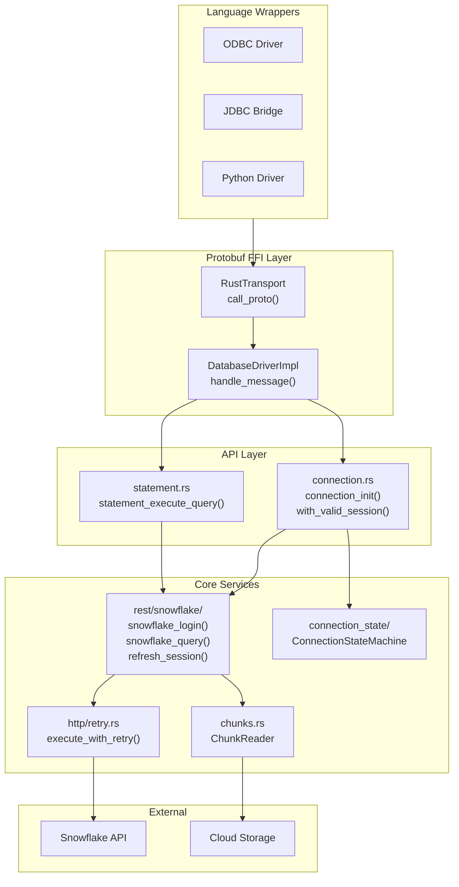

# Universal Driver Service Architecture Design Document

## Status: Draft
## Author: Agent
## Last Updated: 2026-02-01

---

## Overview

This document describes the proposed service-based architecture for the Universal Driver, derived from comprehensive analysis of all existing Snowflake drivers (Go, Python, JDBC, Node.js, .NET, ODBC, libsnowflakeclient). The architecture enables clean separation of concerns, dependency injection, and testability while aligning with the existing `sf_core` Rust implementation.

### Implementation Status

| Component | Status | Location |
|-----------|--------|----------|
| REST API (login, query) | Implemented | `sf_core/src/rest/snowflake/mod.rs` |
| HTTP Retry | Implemented | `sf_core/src/http/retry.rs` |
| Connection State Machine | Implemented | `sf_core/src/connection_state/` |
| Chunk Downloads | Implemented | `sf_core/src/chunks.rs` |
| Protobuf FFI | Implemented | `sf_core/src/protobuf_apis/` |
| Heartbeat Service | Not Implemented | - |
| Logout Service | Not Implemented | - |
| Query Status Monitoring | Not Implemented | - |

---

## 1. Endpoint Reference

### 1.1 Complete Snowflake API Catalog

All Snowflake drivers communicate via the following REST endpoints:

| Endpoint | Method | Purpose | Auth Required |
|----------|--------|---------|---------------|
| `/session/v1/login-request` | POST | Authentication | No (credentials in body) |
| `/session/token-request` | POST | Token refresh | Master Token |
| `/session/heartbeat` | POST | Keep session alive | Session Token |
| `/session?delete=true` | POST | Logout/close session | Session Token |
| `/session/authenticator-request` | POST | OKTA/SSO discovery | No |
| `/queries/v1/query-request` | POST | Execute SQL | Session Token |
| `/queries/{qid}/result` | GET | Fetch query results | Session Token |
| `/monitoring/queries/{qid}` | GET | Query status check | Session Token |
| `/telemetry/send` | POST | Send telemetry | Session Token |

### 1.2 Driver Endpoint Usage by Operation

All drivers support both endpoints - they use them for different purposes:

| Operation | Endpoint | Purpose |
|-----------|----------|---------|
| **Async Status Check** | `GET /monitoring/queries/{qid}` | Check if async query is done (returns status metadata, no data) |
| **Result Fetch** | `GET /queries/{qid}/result` | Fetch actual query results |
| **Long-running Poll** | `GET {getResultUrl}` → `/queries/{qid}/result` | Poll for results during ping-pong |

**How drivers use these endpoints:**

| Use Case | Flow |
|----------|------|
| Sync query completes quickly | `POST /queries/v1/query-request` → returns data inline |
| Sync query takes >45s | `POST /queries/v1/query-request` → code 333333 → poll `getResultUrl` (`/queries/{qid}/result`) |
| Async query | `POST /queries/v1/query-request` → returns queryId → poll `/monitoring/queries/{qid}` until SUCCESS → fetch `/queries/{qid}/result` |

**Key Insight**: The `/monitoring/queries/{qid}` endpoint returns **only status metadata** (RUNNING, SUCCESS, FAILED, etc.), while `/queries/{qid}/result` returns **actual data**. For async queries, drivers first poll monitoring until done, then fetch results.

**Key Insight**: The `/monitoring/queries/{qid}` endpoint returns metadata about query status (running, success, failed), while `/queries/{qid}/result` returns actual data. For async queries, drivers first check status via monitoring, then fetch results.

### 1.3 Request Headers (All SF-Related Requests)

```
Authorization: Snowflake Token="{session_token}"
Accept: application/snowflake
Content-Type: application/json
User-Agent: {application}/{version} ({os}) {runtime}
```

### 1.4 Query Parameters

| Parameter | Purpose | Scope |
|-----------|---------|-------|
| `requestId` | Idempotency key (static per logical request) | All requests |
| `request_guid` | Unique per attempt (for tracing) | All requests |
| `retry` | Indicates retry attempt | Query requests |
| `clientStartTime` | Client timestamp | Query requests |

---

## 2. Error Code Reference

### 2.1 Session-Related Error Codes

| Code | Constant Name | Meaning | Driver Action |
|------|--------------|---------|---------------|
| 390110 | `ID_TOKEN_EXPIRED` | ID token expired | Full re-authentication |
| 390111 | `SESSION_GONE` | Session no longer exists | Ignore on logout, error otherwise |
| 390112 | `SESSION_EXPIRED` | Session token expired | Auto-refresh with master token |
| 390113 | `MASTER_TOKEN_NOT_FOUND` | Master token missing | Full re-authentication |
| 390114 | `MASTER_TOKEN_EXPIRED` | Master token expired | Full re-authentication |
| 390115 | `MASTER_TOKEN_INVALID` | Master token invalid | Full re-authentication |

### 2.2 Query-Related Error Codes

| Code | Constant Name | Meaning | Driver Action |
|------|--------------|---------|---------------|
| 333333 | `QUERY_IN_PROGRESS` | Sync query still running | Poll via `getResultUrl` |
| 333334 | `QUERY_IN_PROGRESS_ASYNC` | Async/detached query | Return queryId or poll |

### 2.3 HTTP Status Codes for Retry

| Status | Meaning | Retry? |
|--------|---------|--------|
| 408 | Request Timeout | Yes |
| 429 | Too Many Requests | Yes (with Retry-After) |
| 500 | Internal Server Error | Yes |
| 502 | Bad Gateway | Yes |
| 503 | Service Unavailable | Yes |
| 504 | Gateway Timeout | Yes |

---

## 3. Current sf_core Architecture

### 3.1 Module Structure

```
sf_core/src/
├── apis/database_driver_v1/    # ADBC-style API implementation
│   ├── connection.rs           # Connection management, login, session refresh
│   ├── statement.rs            # Statement execution
│   ├── query.rs                # Query result processing
│   └── error.rs                # API-level errors
├── rest/snowflake/             # Snowflake REST API
│   ├── mod.rs                  # Login, refresh, query functions
│   ├── async_exec.rs           # Async query execution
│   ├── query_request.rs        # Request structures
│   └── query_response.rs       # Response structures
├── http/
│   └── retry.rs                # HTTP retry with backoff/jitter
├── connection_state/           # State machine (see CONNECTION_STATE_MACHINE.md)
│   ├── machine.rs              # State transitions
│   ├── state.rs                # State enum definitions
│   └── pending_ops.rs          # Queued operations
├── chunks.rs                   # Large result set chunk downloading
├── protobuf_apis/              # Protobuf FFI layer
│   ├── mod.rs                  # Transport routing
│   └── database_driver_v1.rs   # Handler implementations
└── config/
    ├── retry.rs                # Retry policy configuration
    └── rest_parameters.rs      # Login/query parameters
```

### 3.2 Architecture Diagram



### 3.3 Existing Function Signatures

The `sf_core` already implements core functionality that can be formalized into service traits:

```rust
// rest/snowflake/mod.rs - Authentication
pub async fn snowflake_login(
    login_parameters: &LoginParameters,
) -> Result<SessionTokens, RestError>

pub async fn snowflake_login_with_client(
    client: &reqwest::Client,
    login_parameters: &LoginParameters,
) -> Result<SessionTokens, RestError>

// rest/snowflake/mod.rs - Session Refresh  
pub async fn refresh_session(
    client: &reqwest::Client,
    server_url: &str,
    client_info: &ClientInfo,
    tokens: &SessionTokens,
) -> Result<SessionTokens, RestError>

// rest/snowflake/mod.rs - Query Execution
pub async fn snowflake_query_with_client(
    client: &reqwest::Client,
    query_parameters: QueryParameters,
    session_token: String,
    sql: String,
    parameter_bindings: Option<HashMap<String, BindParameter>>,
    retry_policy: &RetryPolicy,
    execution_mode: QueryExecutionMode,
) -> Result<query_response::Response, RestError>

// apis/database_driver_v1/connection.rs - Session Refresh Wrapper
pub async fn with_valid_session<F, Fut, T>(
    conn: &Arc<Mutex<Connection>>,
    f: F,
) -> Result<T, ApiError>
```

---

## 4. Main Execution Flows

### 4.1 Normal Request (Synchronous)

```
cursor.execute(sql) 
    → POST /queries/v1/query-request 
    → wait for result 
    → return data
```

Standard synchronous query execution. The client blocks until the query completes.

### 4.2 Async Request

```
cursor.execute_async(sql) 
    → POST /queries/v1/query-request (async_exec: true)
    → returns immediately with queryId

cursor.get_results_from_sfqid(qid) 
    → GET /monitoring/queries/{qid} (poll status)
    → when SUCCESS: GET /queries/{qid}/result
    → return data
```

Fire-and-forget query submission. Results are fetched later by query ID.

### 4.3 Long-Running Query (Ping-Pong)

When a query takes longer than ~45 seconds, Snowflake returns code 333333/333334:

```
execute()
    → POST /queries/v1/query-request
    → response: { code: "333333", data: { getResultUrl: "/queries/{qid}/result" } }
    → GET {getResultUrl}
    → response: { code: "333333", data: { getResultUrl: "..." } }
    → repeat until code != 333333/333334
    → return final result
```

**Implementation in drivers:**

```go
// Go driver (restful.go)
for respd.Code == queryInProgressCode || respd.Code == queryInProgressAsyncCode {
    fullURL = sr.getFullURL(respd.Data.GetResultURL, nil)
    respd, err = getExecResponse(ctx, sr, fullURL, headers, timeout)
}
```

```python
# Python driver (network.py)
while ret.get("code") in (QUERY_IN_PROGRESS_CODE, QUERY_IN_PROGRESS_ASYNC_CODE):
    result_url = ret["data"]["getResultUrl"]
    ret = self._get_request(result_url, headers, token=self.token, timeout=timeout)
```

### 4.4 Large Result Set (Chunk Fetching)

```
execute() 
    → POST /queries/v1/query-request 
    → initial response with chunk metadata:
      {
        "rowsetBase64": "...",  // First chunk (inline)
        "chunks": [
          { "url": "https://s3.../chunk1", "rowCount": 10000 },
          { "url": "https://s3.../chunk2", "rowCount": 10000 }
        ],
        "chunkHeaders": { "x-amz-server-side-encryption-customer-key": "..." }
      }
    → parallel GET chunk URLs from CSP
    → decompress and assemble Arrow batches
```

**Current implementation in sf_core:**

```rust
// chunks.rs
pub async fn get_chunk_data(client: &Client, chunk: &ChunkDownloadData) -> Result<Vec<u8>, ChunkError> {
    let policy = RetryPolicy::default();
    let ctx = HttpContext::new(Method::GET, url.clone()).with_idempotent(true);
    
    let response = execute_with_retry(
        || client.get(url.clone()).headers(headers.clone()),
        &ctx,
        &policy,
        |r| async move { Ok(r) },
    ).await?;
    // decompress and return
}
```

### 4.5 PUT/GET (File Transfer)

```
cursor.execute("PUT @stage ...")
    → POST /queries/v1/query-request
    → response contains stage info & credentials:
      {
        "command": "UPLOAD",
        "stageInfo": { "locationType": "S3", "location": "...", "credentials": {...} }
      }
    → StorageClient.upload() to CSP (S3/Azure/GCS)
    
cursor.execute("GET @stage ...")
    → similar flow but download
```

---

## 5. Session Management Flows

### 5.1 Heartbeat

Heartbeat keeps the session alive and is used to detect session expiration early.

**Interval Calculation** (consistent across all drivers):

```go
// Go driver
const minHeartBeatInterval = 900 * time.Second   // 15 minutes
const maxHeartBeatInterval = 3600 * time.Second  // 1 hour
const defaultHeartBeatInterval = 3600 * time.Second
```

```cpp
// ODBC driver
long HeartbeatBackground::calculateHeartBeatInterval(long master_token_validation_time) {
    return master_token_validation_time / 4;
}
```

**Heartbeat Flow:**

```
Background thread/task:
    every {master_token_validity / 4} seconds:
        → POST /session/heartbeat
        → if response code == 390112:
            → refresh_session()
            → retry heartbeat
```

**JDBC Pattern** (HeartbeatBackground.java):

```java
public void run() {
    for (SFSession session : sessions.keySet()) {
        session.heartbeat();
    }
    if (sessions.size() > 0) {
        scheduleHeartbeat();
    }
}
```

### 5.2 Session Token Refresh

When session token expires (code 390112), drivers automatically refresh:

```
Request fails with code 390112
    → POST /session/token-request
      Headers: Authorization: Snowflake Token="{master_token}"
      Body: { "oldSessionToken": "...", "requestType": "RENEW" }
    → Response: { "sessionToken": "...", "masterToken": "...", "validityInSecondsST": 3600 }
    → Retry original request with new token
```

**Current implementation in sf_core:**

```rust
// rest/snowflake/mod.rs
pub async fn refresh_session(
    client: &reqwest::Client,
    server_url: &str,
    client_info: &ClientInfo,
    tokens: &SessionTokens,
) -> Result<SessionTokens, RestError> {
    let body = serde_json::json!({
        "oldSessionToken": tokens.session_token,
        "requestType": "RENEW"
    });
    // POST with master token in Authorization header
}
```

**Wrapper with automatic refresh:**

```rust
// apis/database_driver_v1/connection.rs
pub async fn with_valid_session<F, Fut, T>(conn: &Arc<Mutex<Connection>>, f: F) -> Result<T, ApiError>
where
    F: Fn(String) -> Fut,
    Fut: Future<Output = Result<T, RestError>>,
{
    // First attempt
    match f(session_token).await {
        Ok(result) => Ok(result),
        Err(RestError::InvalidSnowflakeResponse { source: SessionExpired { .. }, .. }) => {
            // Refresh and retry
            let new_tokens = refresh_session(...).await?;
            f(new_tokens.session_token).await
        }
        Err(e) => Err(e),
    }
}
```

### 5.3 Logout / Close Session

**Endpoint:** `POST /session?delete=true&requestId={uuid}`

**Behavior across drivers:**

| Driver | On Success | On 390111 (Session Gone) | On Other Error |
|--------|-----------|-------------------------|----------------|
| Go | Return success | Log warning, return success | Return error |
| Python | Return success | Ignore | Return error |
| JDBC | Return success | Ignore | Return error |
| Node.js | Return success | Ignore | Return error |
| .NET | Return success | Ignore | Return error |

**Go implementation:**

```go
func closeSession(ctx context.Context, sr *snowflakeRestful, timeout time.Duration) error {
    // POST /session?delete=true
    if respd.Code == sessionGoneCode {
        return nil  // Already gone, not an error
    }
    if !respd.Success {
        return &SnowflakeError{Number: ErrFailedToCloseSession, ...}
    }
    return nil
}
```

---

## 6. Query Status Monitoring

### 6.1 Monitoring vs Result Endpoints

| Endpoint | Purpose | Returns |
|----------|---------|---------|
| `/monitoring/queries/{qid}` | Check status only | Status metadata (no data) |
| `/queries/{qid}/result` | Fetch results | Full query results |

**When to use each:**

- **Async queries**: First poll `/monitoring/queries/{qid}` until status is SUCCESS, then fetch `/queries/{qid}/result`
- **Long-running sync**: Follow `getResultUrl` from response (points to `/queries/{qid}/result`)

### 6.2 Query Status Values

```javascript
// From all drivers (consistent)
const QueryStatus = {
    RUNNING: 'RUNNING',
    ABORTING: 'ABORTING', 
    SUCCESS: 'SUCCESS',
    FAILED_WITH_ERROR: 'FAILED_WITH_ERROR',
    ABORTED: 'ABORTED',
    QUEUED: 'QUEUED',
    FAILED_WITH_INCIDENT: 'FAILED_WITH_INCIDENT',
    DISCONNECTED: 'DISCONNECTED',
    RESUMING_WAREHOUSE: 'RESUMING_WAREHOUSE',
    QUEUED_REPAIRING_WAREHOUSE: 'QUEUED_REPARING_WAREHOUSE',  // Note: typo in Snowflake API
    RESTARTED: 'RESTARTED',
    BLOCKED: 'BLOCKED',
    NO_DATA: 'NO_DATA'
};

// Still running statuses
const runningStatuses = ['RUNNING', 'RESUMING_WAREHOUSE', 'QUEUED', 'QUEUED_REPARING_WAREHOUSE', 'NO_DATA'];

// Error statuses
const errorStatuses = ['ABORTING', 'FAILED_WITH_ERROR', 'ABORTED', 'FAILED_WITH_INCIDENT', 'DISCONNECTED', 'BLOCKED'];
```

### 6.3 Async Query Retry Pattern

All drivers use similar exponential backoff for async status polling:

```go
// Go driver (async.go)
retryPattern := []int32{1, 1, 2, 3, 4, 8, 10}  // seconds

for {
    status := checkQueryStatus(qid)
    if !status.isRunning() {
        break
    }
    time.Sleep(500 * time.Millisecond * retryPattern[retryPatternIndex])
    if retryPatternIndex < len(retryPattern)-1 {
        retryPatternIndex++
    }
}
```

---

## 7. Proposed Service Architecture

### 7.1 Architecture Diagram

```
┌─────────────────────────────────────────────────────────────────────────────┐
│                              Connection                                      │
│  ┌───────────────────────────────────────────────────────────────────────┐  │
│  │                        ServiceContainer                                │  │
│  │   ┌─────────────┐  ┌─────────────┐  ┌─────────────┐  ┌─────────────┐  │  │
│  │   │ AuthService │  │SessionService│  │QueryService │  │StorageService│  │
│  │   └─────────────┘  └─────────────┘  └─────────────┘  └─────────────┘  │  │
│  └───────────────────────────────────────────────────────────────────────┘  │
│                                    │                                         │
│                        ConnectionStateMachine                                │
└─────────────────────────────────────────────────────────────────────────────┘
                                       │
                                       ▼
                    ┌─────────────────────────────────────┐
                    │         HttpClient (trait)          │
                    │  request(method, url, headers, body)│
                    └─────────────────────────────────────┘
                                       │
                    ┌──────────────────┴──────────────────┐
                    ▼                                     ▼
         ┌─────────────────────┐              ┌─────────────────────┐
         │  ReqwestHttpClient  │              │   MockHttpClient    │
         │    (production)     │              │     (testing)       │
         └─────────────────────┘              └─────────────────────┘
```

### 7.2 Service Traits (Aligned with Existing Code)

```rust
/// Authentication operations - wraps existing snowflake_login functions
pub trait AuthService: Send + Sync {
    async fn login(&self, params: &LoginParameters) -> Result<SessionTokens, AuthError>;
    async fn refresh(&self, tokens: &SessionTokens) -> Result<SessionTokens, AuthError>;
}

/// Session management - NEW, needs implementation
pub trait SessionService: Send + Sync {
    async fn logout(&self, token: &str, config: &LogoutConfig) -> Result<(), SessionError>;
    async fn heartbeat(&self, token: &str) -> Result<(), SessionError>;
}

/// Query execution - wraps existing snowflake_query functions
pub trait QueryService: Send + Sync {
    async fn execute(
        &self, 
        token: &str, 
        sql: &str, 
        params: &QueryParams,
        mode: QueryExecutionMode,
    ) -> Result<QueryResult, QueryError>;
    
    async fn fetch_result(&self, token: &str, query_id: &str) -> Result<QueryResult, QueryError>;
    async fn get_status(&self, token: &str, query_id: &str) -> Result<QueryStatus, QueryError>;
    async fn cancel(&self, token: &str, query_id: &str) -> Result<(), QueryError>;
}

/// Cloud storage operations - wraps existing file_manager
pub trait StorageService: Send + Sync {
    async fn upload(&self, meta: &FileMeta, credentials: &StorageCredentials) -> Result<(), StorageError>;
    async fn download(&self, meta: &FileMeta, credentials: &StorageCredentials) -> Result<Vec<u8>, StorageError>;
}
```

### 7.3 Integration with Connection State Machine

The service architecture integrates with the existing `ConnectionStateMachine`:

```rust
pub struct Connection {
    // Services
    auth_service: Arc<dyn AuthService>,
    session_service: Arc<dyn SessionService>,
    query_service: Arc<dyn QueryService>,
    storage_service: Arc<dyn StorageService>,
    
    // State (from connection_state module)
    state_machine: ConnectionStateMachine,
    tokens: Arc<AsyncRwLock<Option<SessionTokens>>>,
    
    // Configuration
    http_client: reqwest::Client,
    server_url: String,
    client_info: ClientInfo,
}

impl Connection {
    pub async fn execute_query(&self, sql: &str) -> Result<QueryResult, ApiError> {
        // Use state machine to wait for ready state
        self.state_machine.wait_ready(Duration::from_secs(30)).await?;
        
        // Execute with automatic session refresh
        with_valid_session(&self.tokens, |token| {
            self.query_service.execute(&token, sql, &params, QueryExecutionMode::Blocking)
        }).await
    }
    
    pub async fn close(&self) -> Result<(), ApiError> {
        let token = self.tokens.read().await.as_ref()
            .map(|t| t.session_token.clone())
            .ok_or(ApiError::NotConnected)?;
            
        // Logout (best-effort)
        let _ = self.session_service.logout(&token, &LogoutConfig::default()).await;
        
        // Transition state machine
        self.state_machine.disconnect(DisconnectReason::UserInitiated).await?;
        
        Ok(())
    }
}
```

---

## 8. Protobuf FFI Pattern

### 8.1 Current Architecture

The Universal Driver uses Protobuf for FFI between language wrappers and the Rust core:

```
┌──────────────┐     Protobuf      ┌──────────────────┐
│ ODBC/JDBC/   │ ──── Bytes ────▶  │  RustTransport   │
│ Python       │                   │  call_proto()    │
└──────────────┘                   └────────┬─────────┘
                                            │
                                   ┌────────▼─────────┐
                                   │DatabaseDriverImpl│
                                   │ handle_message() │
                                   └────────┬─────────┘
                                            │
                                   ┌────────▼─────────┐
                                   │  apis/database_  │
                                   │  driver_v1/      │
                                   └──────────────────┘
```

### 8.2 Adding New Services

To add a new service (e.g., Heartbeat):

**Step 1: Define in `database_driver_v1.proto`**

```protobuf
message ConnectionHeartbeatRequest {
  ConnectionHandle conn_handle = 1;
}

message ConnectionHeartbeatResponse {
}

service DatabaseDriver {
  // ... existing methods ...
  rpc ConnectionHeartbeat(ConnectionHeartbeatRequest) returns (ConnectionHeartbeatResponse);
}
```

**Step 2: Regenerate Rust code**

```bash
cd proto_generator
cargo run
```

**Step 3: Implement handler in `protobuf_apis/database_driver_v1.rs`**

```rust
impl DatabaseDriverServer for DatabaseDriverImpl {
    fn connection_heartbeat(
        &self,
        request: ConnectionHeartbeatRequest,
    ) -> Result<ConnectionHeartbeatResponse, DriverException> {
        let conn = get_connection(request.conn_handle)?;
        connection::connection_heartbeat(conn.id)?;
        Ok(ConnectionHeartbeatResponse {})
    }
}
```

**Step 4: Implement core logic in `apis/database_driver_v1/connection.rs`**

```rust
pub fn connection_heartbeat(conn_handle: Handle) -> Result<(), ApiError> {
    let conn = CONN_HANDLE_MANAGER.get_obj(conn_handle)
        .ok_or(ApiError::InvalidHandle)?;
    
    let rt = tokio::runtime::Runtime::new()?;
    rt.block_on(async {
        let guard = conn.lock()?;
        let token = guard.tokens.read().await
            .as_ref()
            .map(|t| t.session_token.clone())
            .ok_or(ApiError::NotConnected)?;
        
        heartbeat_request(&guard.http_client, &guard.server_url, &token).await
    })
}
```

---

## 9. Request Type Taxonomy

### 9.1 Auth-Related Requests

**Endpoints:**
- `/session/v1/login-request` (various authentication methods)
- `/session/token-request` (token refresh)
- `/session/authenticator-request` (OKTA/SSO discovery)
- External: OAuth providers, OKTA, Browser SSO

**Characteristics:**
- Pre-session (no session token yet, or special token handling)
- Special error handling (credentials vs connectivity errors)
- May involve external redirects (browser auth, OKTA)
- Different retry semantics (some errors should not retry)

**Authentication Methods Supported:**
- Default (username/password)
- External Browser (SSO)
- Key Pair (JWT)
- OAuth (Authorization Code, Client Credentials)
- ID Token
- Username/Password with MFA
- Programmatic Access Token (PAT)
- Workload Identity

### 9.2 SF-Related Requests (Snowflake Core)

**Characteristics:**
- Session token in `Authorization: Snowflake Token="{token}"` header
- Error code 390112 triggers automatic session refresh
- Common retry policy for transient errors (503, 429, 408, etc.)
- `requestId` and `request_guid` query parameters
- Gzip compression for POST body

### 9.3 CSP-Related Requests (Cloud Storage Providers)

**Operations:**
- S3: PUT/GET with presigned URLs, multipart upload
- Azure Blob: PUT/GET with SAS tokens
- GCS: PUT/GET with presigned URLs or OAuth

**Characteristics:**
- Cloud-specific credentials (temporary, refreshable via Snowflake)
- Chunked transfer for large files
- Client-side encryption/decryption
- Different transient error codes: 408, 429, 500, 502, 503, 504
- Exponential backoff with jitter

---

## 10. Testing Strategy

### 10.1 Testing Matrix

| Test Level | What's Real | What's Mocked | Verifies |
|------------|-------------|---------------|----------|
| Unit | `Connection.close()` | `SessionService` | Business logic, state management |
| Service Integration | `SnowflakeSessionService` | `HttpClient` | Request construction, error handling |
| HTTP Integration | All Rust code | Wiremock server | Full HTTP flow, headers, body |
| E2E | All code | Nothing | Real Snowflake behavior |

### 10.2 Wiremock Mappings

Example mappings for common scenarios:

```json
// Long-running query
{
  "request": { "urlPathPattern": "/queries/v1/query-request" },
  "response": {
    "status": 200,
    "jsonBody": {
      "success": true,
      "code": "333334",
      "data": {
        "queryId": "01bfd516-0009-ae23-0000-4c390101d1aa",
        "getResultUrl": "/queries/01bfd516-0009-ae23-0000-4c390101d1aa/result"
      }
    }
  }
}

// Session expired
{
  "request": { "urlPathPattern": "/queries/.*" },
  "response": {
    "status": 200,
    "jsonBody": { "success": false, "code": "390112", "message": "Session expired" }
  }
}
```

---

## 11. Migration Path

### Phase 1: Define Service Traits
- Define `SessionService`, `QueryService` traits based on existing functions
- Keep existing implementation working

### Phase 2: Implement Missing Services
- Implement `SessionService.heartbeat()` 
- Implement `SessionService.logout()`
- Implement `QueryService.get_status()` (monitoring endpoint)

### Phase 3: Integrate with State Machine
- Wire services to use `ConnectionStateMachine`
- Implement heartbeat background task

### Phase 4: Add Protobuf Methods
- Add `ConnectionHeartbeat`, `ConnectionLogout` to proto
- Implement handlers

### Phase 5: Testing
- Add unit tests with mock services
- Add Wiremock integration tests
- Verify against real Snowflake

---

## 12. Open Questions

1. **Heartbeat scheduling**: Should heartbeat run as a background tokio task per-connection, or use a shared scheduler like JDBC's `HeartbeatBackground`?

2. **State machine integration**: Should services have direct access to the state machine, or should the Connection coordinate all state transitions?

3. **Retry policy per-service**: Should each service have its own retry policy, or share a connection-level policy?

4. **Telemetry**: Should telemetry be a separate service or handled as a cross-cutting concern?

---

## References

- Connection State Machine Design: `docs/CONNECTION_STATE_MACHINE.md`
- Go Driver: `drivers/gosnowflake/`
- Python Connector: `drivers/snowflake-connector-python/`
- JDBC Driver: `drivers/snowflake-jdbc/`
- Node.js Connector: `drivers/snowflake-connector-nodejs/`
- .NET Connector: `drivers/snowflake-connector-net/`
- ODBC Driver: `drivers/snowflake-odbc/`
